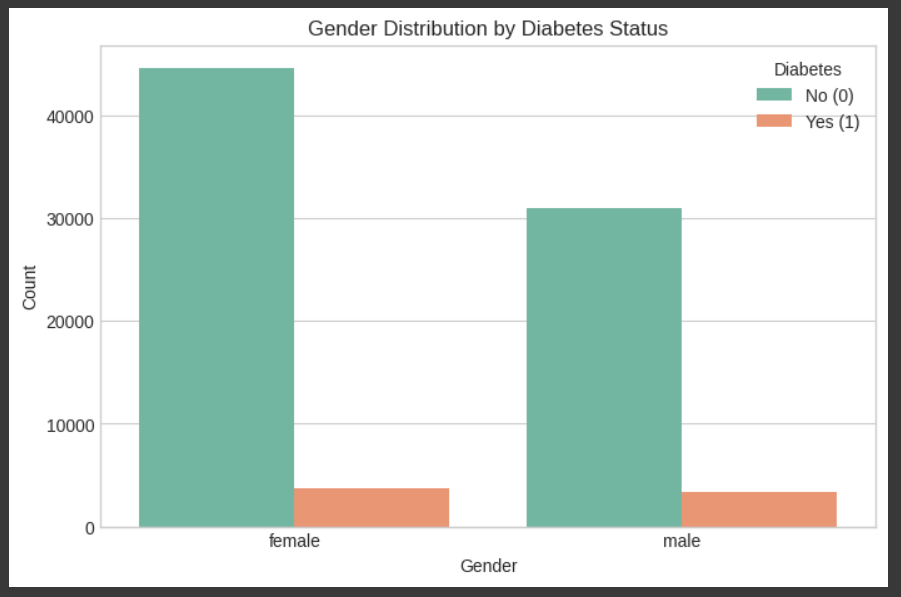
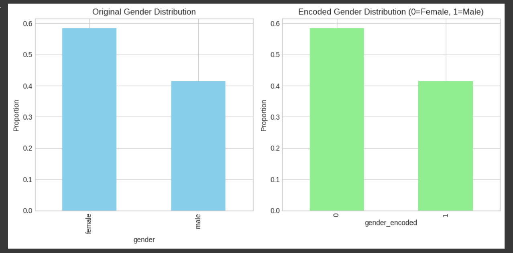

# Early-Stage Diabetes Prediction — Logistic Regression on Imbalanced Health Data

> Binary classification of diabetes risk from ~100,000 patient health records, with a focus on handling severe class imbalance (91.5% non-diabetic vs 8.5% diabetic) so that real diabetic cases are not missed.


This repository showcases my individual contribution to a group machine-learning project completed for **IT2011 – Artificial Intelligence and Machine Learning** (Year 2, Semester 1, 2025) at **SLIIT**. It is published here as a portfolio piece with my team's permission.

---

## Table of Contents

- [Problem & Motivation](#problem--motivation)
- [Dataset](#dataset)
- [My Contribution](#my-contribution)
- [Approach](#approach)
- [Results](#results)
- [Exploratory Data Analysis](#exploratory-data-analysis)
- [Repository Structure](#repository-structure)
- [How to Run](#how-to-run)
- [Tech Stack](#tech-stack)
- [Team & Attribution](#team--attribution)
- [About Me](#about-me)

---

## Problem & Motivation

Diabetes is most treatable when caught early, but screening datasets are heavily skewed toward healthy patients. A model that simply predicts "no diabetes" for everyone would still be ~91% accurate while being clinically useless — it would miss almost every patient who actually needs care.

The goal of this work is therefore **not raw accuracy** but **recall on the positive (diabetic) class**: catching as many true diabetic patients as possible while keeping the model interpretable enough to be trusted in a health context.

---

## Dataset

| Property | Value |
| --- | --- |
| Source | [Diabetes Prediction Dataset (Kaggle)](https://www.kaggle.com/datasets/iammustafatz/diabetes-prediction-dataset) |
| Records | ~100,000 patients |
| Features | 8 health indicators (age, BMI, HbA1c level, blood glucose level, hypertension, heart disease, gender, smoking history) |
| Target | `diabetes` (0 = non-diabetic, 1 = diabetic) |
| Class balance | **91.5% non-diabetic / 8.5% diabetic** (severe imbalance) |

A copy of the dataset is included in [`data/`](./data) so the notebooks are fully reproducible.

---

## My Contribution

**W.P. Kumudu Ayesha Dilhani — IT24100263**

My individual responsibilities within the group project were:

1. **Label-encoding preprocessing** for the `gender` categorical feature — cleaning inconsistent casing/whitespace, dropping the negligible `Other` category (~0.018% of rows), and encoding to `0 = Female`, `1 = Male`. See [`notebooks/01_label_encoding_preprocessing.ipynb`](./notebooks/01_label_encoding_preprocessing.ipynb).

2. **Building and evaluating three Logistic Regression model variants** to study how class-imbalance handling changes performance. See [`notebooks/02_logistic_regression_models.ipynb`](./notebooks/02_logistic_regression_models.ipynb):
   - **Variant 1 — Baseline:** scaling only, no balancing.
   - **Variant 2 — Class weighting:** `class_weight='balanced'` + `GridSearchCV` hyperparameter tuning.
   - **Variant 3 — SMOTE:** synthetic minority oversampling + `GridSearchCV`.

3. **Rigorous evaluation** using Stratified 5-fold cross-validation, an 80/20 stratified train/test split, and a full metric suite (Accuracy, Precision, Recall, F1, ROC-AUC, confusion matrix, ROC curves), with **Recall and F1 prioritised** for this imbalanced medical task.

The group's combined preprocessing pipeline is also included for context in [`notebooks/group_combined_pipeline.ipynb`](./notebooks/group_combined_pipeline.ipynb).

---

## Approach

```
Raw data
  → Clean & label-encode `gender` (my preprocessing)
  → One-hot encode `smoking_history`
  → 80/20 stratified train/test split
  → StandardScaler
  → Logistic Regression  ── Variant 1: baseline
                          ── Variant 2: class_weight='balanced' + GridSearchCV
                          ── Variant 3: SMOTE + GridSearchCV
  → Evaluate with Stratified 5-fold CV (accuracy, precision, recall, F1, ROC-AUC)
```

Hyperparameter search tuned regularisation strength (`C` ∈ {0.01, 0.1, 1, 10}) and solver (`liblinear`, `lbfgs`) via `GridSearchCV` scored on F1.

---

## Results

All metrics are on the held-out 20% test set.

| Variant | Accuracy | Precision | Recall | F1 | ROC-AUC |
| --- | :---: | :---: | :---: | :---: | :---: |
| 1 — Baseline (scaling only) | **0.962** | **0.879** | 0.637 | **0.739** | 0.962 |
| 2 — Class weighting + GridSearchCV | 0.889 | 0.426 | **0.890** | 0.576 | **0.963** |
| 3 — SMOTE + GridSearchCV | 0.889 | 0.427 | 0.887 | 0.576 | 0.963 |

**Key takeaway:** The baseline reaches the highest headline accuracy, but its recall of only 0.64 means it misses roughly a third of diabetic patients. Applying **class weighting lifts recall from 0.64 to 0.89** — the model now catches ~9 in 10 true cases — at the expected cost of precision. For an early-screening tool where a missed diagnosis is far costlier than a false alarm, **Variant 2 (class weighting) is the most appropriate choice**, delivering the best recall (0.890) and ROC-AUC (0.963). SMOTE produced near-identical results, confirming the gain comes from rebalancing rather than the specific technique.

---

## Exploratory Data Analysis

**Gender distribution by diabetes status (raw data)**



**Original vs. label-encoded gender distribution** (verifying the encoding preserved the underlying distribution)



---

## Repository Structure

```
diabetes-prediction-ml/
├── data/
│   └── diabetes_prediction_dataset.csv          # ~100k patient records (Kaggle)
├── notebooks/
│   ├── 01_label_encoding_preprocessing.ipynb    # My preprocessing: gender label encoding + EDA
│   ├── 02_logistic_regression_models.ipynb      # My 3 Logistic Regression variants + evaluation
│   └── group_combined_pipeline.ipynb            # Full group preprocessing pipeline (context)
├── figures/
│   ├── gender_vs_diabetes.png
│   └── original_vs_encoded_gender_distribution.png
├── requirements.txt
├── LICENSE
└── README.md
```

---

## How to Run

```bash
# 1. Clone the repository
git clone https://github.com/kumuduayesha/diabetes-prediction-ml.git
cd diabetes-prediction-ml

# 2. (Recommended) create a virtual environment
python -m venv venv
source venv/bin/activate        # On Windows: venv\Scripts\activate

# 3. Install dependencies
pip install -r requirements.txt

# 4. Launch Jupyter and run the notebooks top to bottom
jupyter notebook
```

Start with `notebooks/01_label_encoding_preprocessing.ipynb`, then `notebooks/02_logistic_regression_models.ipynb`.

---

## Tech Stack

**Language:** Python

**Libraries:** scikit-learn · imbalanced-learn (SMOTE) · Pandas · NumPy · Matplotlib · Seaborn

**Techniques:** Label Encoding · One-Hot Encoding · StandardScaler · Logistic Regression · Class Weighting · SMOTE · GridSearchCV · Stratified K-Fold Cross-Validation · ROC-AUC analysis

---

## Team & Attribution

This was a group assignment (**Group ID: 2025-Y2-S1-MLB-B3G2-05**) in which each member owned a preprocessing technique and a classification model. This repository highlights **my individual contribution** (label encoding + Logistic Regression) and includes the shared group pipeline **for context, published with my team's permission**. Full credit for the other models and preprocessing steps belongs to the respective group members.

---

## About Me

**W.P. Kumudu Ayesha Dilhani**
BSc (Hons) in Information Technology, specialising in Data Science — SLIIT (GPA 3.36)

Aspiring Data Analyst. Interested in turning messy, real-world data into decisions people can trust.

- GitHub: [github.com/kumuduayesha](https://github.com/kumuduayesha)
- Email: kumuduayesha95@gmail.com
